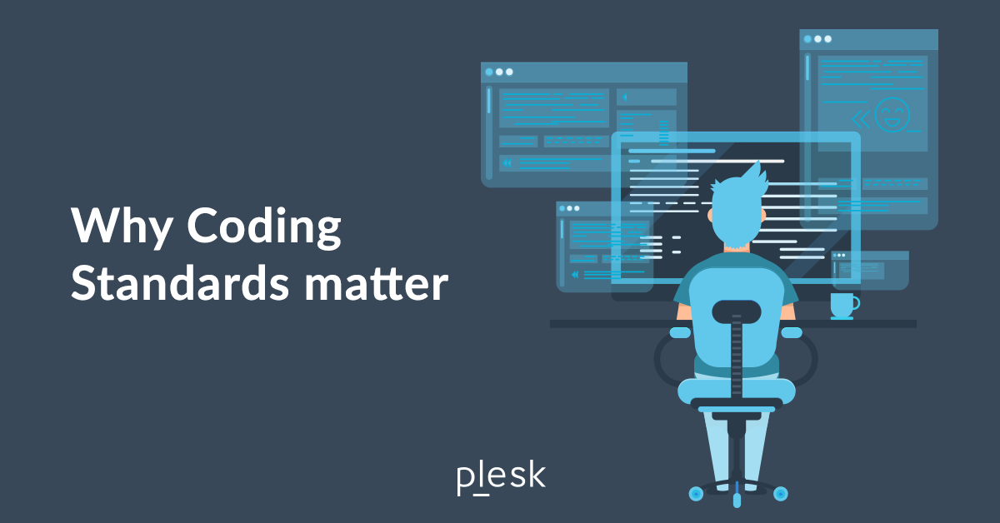

## Importance

It can certainly be annoying when using any coding standard. Having to care about little things like indentation, the seemingly inconsequential white space, or maybe even how you place your braces. However, while it can be easy to dismiss the importance of 
coding standards because of the nuisance it can be, they are one of the many important aspects of successful software development.

### So Why?

Coding standards are not just small cosmetic nuisances that you have to correct. They are a standard for how a team of developers must write and structure their code. Whilst some standards may seem pointless, many serve a critical role in 
consistency & readability. Let's imagine a scenario where you had to look through documentation on a topic you were interested in learning about. Now, what if for every section, it had a different font, font size, spacing, color, etc.. You could 
certainly still read it, however it would take a considerable amount of unecessary effort to deal with. You'd think to yourself "why couldn't everything just be the same?". That's the same for programming as it is writing.

## My Impressions of Coding Standards

After my first week of using ESLint, I find it painful to install and a pain to have. However, despite my initial grievances with having it setup, I believe that it will help anyone who wants to look over the programs I create, and in turn, help 
me read anyone else's. Being forced into doing things one way, is the best way to ensure readable code, and it will help other people help you because they can key in on the source of your issues without needing to pour in unecessary time actually 
trying to read your code. While it may be a challenge for the individual, it is a boon for the group as a whole.