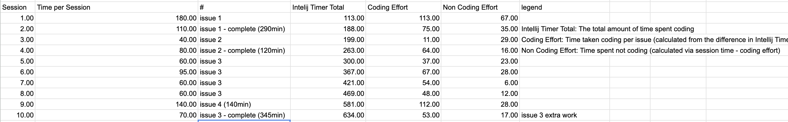

Each team member should write a technical essay addressing the following questions with specific examples and details:

## Overview

For the software engineering project we made, Envision Lahaina, I diligently tracked the time I took when working on a particular issue alongside my believed estimates to how long I thought the issue would take. The estimates were never going to
be accurate, but they served as a strong gauge for comparing how much time a new software developer actually spends vs. what they thought. Estimates are essential because it allows different groups to coordinate around when a product is expected
to release. An incorrect estimate can cost a company time and money since many other groups must rely on others to meet their deadlines. In order to effectively track categories of how time was spent, I used a timer extension in Intellij IDEA
called Darkyen's Time Tracker.

## How I Made My Estimates

When it came to making estimates about how much time I would spend total on an issue, I didn't really put too much thought into how long I would take to finish the issue. I just thought about how comfortable I was with what I would be
implementing and I made a time that I felt I could finish it in. Thus, I didn't really draw on much experience at all outside of my own abilities. I am quite new to much of the technology in this class and I believe that unfamiliarity caused me
to be stuck on problems that you would typically expect someone experienced to finish quickly. For example, spending much of your time googling how to properly center a div on a webpage is something only a novice gets stuck on. As a result,
estimates are unlikely to be completely accurate. The only times that I came close to my estimate times were when I was more familiar with what I was doing and when I was able to truly lock in and focus on the assignment. Programming is a
skill that requires
deep patience and focus as foretold in the beginning of the course. If you don't have that, you will take much longer if your consistently distracted.

Benefits of Making Estimates

Although my estimates were never correct. I was able to learn the extent of my abilities and what I am capable of doing in a fixed amount of time. Furthermore, the absolute most important thing I learned throughout the process of time tracking
was to double or even triple your estimates. There are so many unaccounted variables and unknowns that you'll come across that will eat away at the time you spend on a project. Whether that be simply wanting to take a break or a seemingly simple
task that's giving you a hard time. A good analogy is to this is like watching a short 5 how-to video, but you end up spending an hour total because of that one step you just couldn't figure out they did it in a few seconds. By furthering your
estimates, you remove the stress it takes to implement something, and in the end, you end up with a non-rushed, solid project that makes it into production. Also, it removes the stress from those who are working around you. Your project managers
and other teams won't get upset if you don't need to delay your project. A small gear that stops can stop potentially stop the engine. That must be avoided in order to maintain continuity in a project.

## How I Tracked my Efforts

I believe that the tracking I did was quite accurate. I used Darkyen's Time Tracker extension and I changed the settings to pause the timer after 30 seconds which is more accurate in displaying time spent coding vs not coding. I tracked my
efforts by using a pomodoro app to track the time I spent working each session. Whenever I felt like stopping and taking a break, I would simply stop the timer at the 5 minute or 10 minute mark. Afterward, I would write the current time on the
Intellij Time Tracker and put it in the spreadsheet. Next, I would calculate the coding effort by using the most recent time and subtracting it from the second to last time. That would give you the Coding Effort for the session. Then, I just
calculated the Non-Coding Effort by subtracting the coding effort from the session time.
I would keep doing this for every session until I finished the issue. Once I finished, I would mark the completion time and fill out the main spreadsheet.

### Sample

Sample:

- issue 1 calculations: 290 total time (total time on issue) - 188 (total coding effort) = 102 (total Non Coding Effort)
- issue 2 calculations: 120 total time (total time on issue) - 75 (total coding effort) = 45 (total Non Coding Effort)

