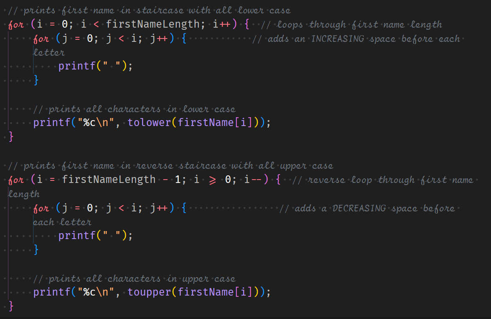

Word Staircase is a very basic project as a part of my coursework in ICS 212 during the Spring 2023 semester. The program essentially manipulates a string you provide in various ways, such as converting it to lowercase, uppercase, or toggle case, and creating a staircase pattern with it.

In this project, I gained a stronger understanding of how methods function and how to apply them in a practical context. By practicing various use cases for these methods, I developed the ability to recognize when I can incorporate them into future projects
