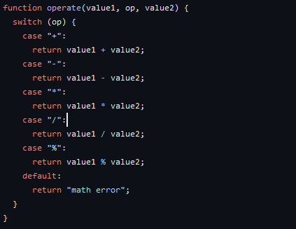

Calculator is a small individual project I developed as part of my coursework during ICS 212 in Spring 2023. This program is a basic calculator that implements fundamental mathematical operations, including addition, subtraction, multiplication, and division.

The project helped me reinforce the syntax for C and become more proficient in the language. As a result, I can feel comfortable applying concepts and ideas precisely in the language.
