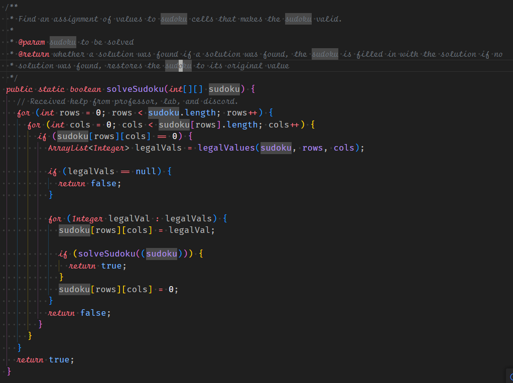

## Overview

## Contributions

## What I Learned

#### Related Links

<a href="https://github.com/envision-lahaina/">Organization Page</a>

<a href="https://envision-lahaina.github.io/envision-lahaina-/">Project Page</a>

<a href="https://github.com/envision-lahaina/envision-lahaina-app/">Github Repository </a>

<a href="https://envisionlahaina.com/">Website Link </a>
