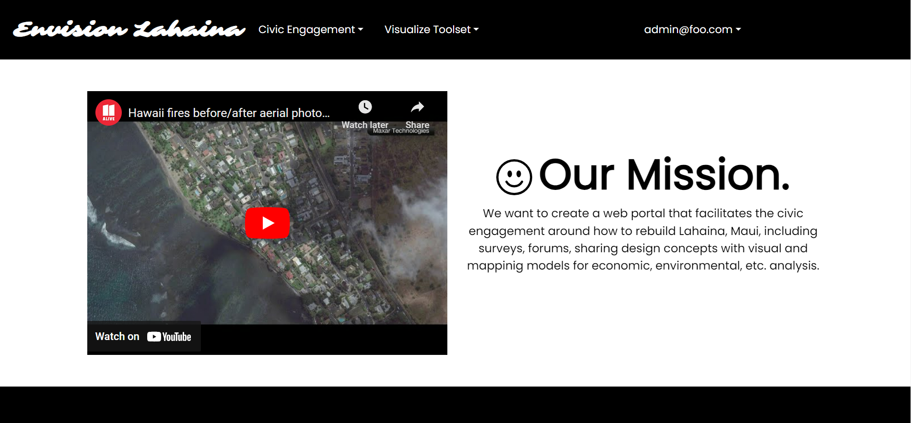

## Overview

This project was created as an idea towards facilitating engagement and ways to help with the disaster that the wildfires created in Lahaina. On this website, users are able to create survey's and forum posts to facilitate engagement and rebuilding efforts towards Lahaina. The webpage also features AI image generation for envisioning future projects, an interactive map to pitch ideas towards building infrastructure, and finally external links on recent articles of the disaster. With this in mind, we hope that this project can spark efforts that benefit the community.

## Contributions

In this project my role was to design the user interface and user experience to make the webpage both easy to use and look at. I completely redesigned all the pages on the project to look sharp but simple enough that anyone can use the website with ease. Additionally, I worked on bug fixes to the UI and making the website usable on mobile devices.

## My Experiences

In this project, I learned that building software is challenging. However despite that challenge, I learned that persistence and hardwork will allow you to implement anything as long as you put your mind to it. The project featured many different technologies and challenges, but all these things are learnable due to the convenience of resources on the internet that allow you to work quickly and implement at a fast pace. In particular, I learned a lot about how to design webpages that are simple and functional, but look good. I also learned how fickle bugs are and how important patience is on any software project.

#### Related Links

<a href="https://github.com/envision-lahaina/">Organization Page</a>

<a href="https://envision-lahaina.github.io/envision-lahaina-/">Project Page</a>

<a href="https://github.com/envision-lahaina/envision-lahaina-app/">Github Repository </a>

<a href="https://envisionlahaina.com/">Website Link </a>
